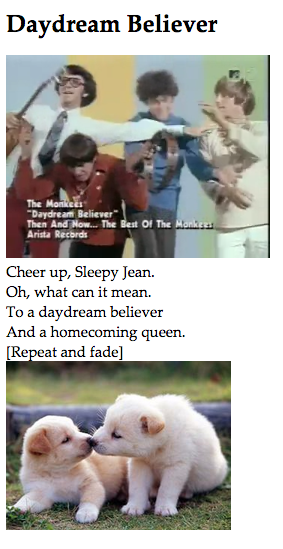

<h1>Karaoke</h1>
<a href="http://ahakone.github.io/karaoke/"> Link </a>

 Using JavaScript media events

<h4> Description </h4>

	By stanza annotation (event/time dependent) of Monkees' "Daydream Believer" music video using JavaScript.
	

