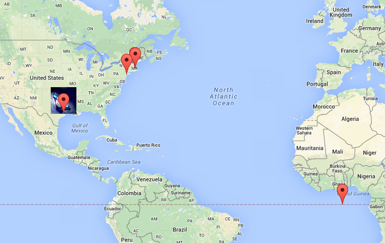

<h1> Marauder's Map </h1>
<a href="http://ahakone.github.io/comp20-ahakone/mmap/"> Link </a>

<h4> Description </h4>

	Retrieves the user's current location and sends the information to a MongoDB of a <a href="http://radiant-savannah-1624.herokuapp.com/">Heroku app</a>. It also retrieves and displays the locations and timestamps of a cast of "characters" and other users on the map. The distance between the user and each character are displayed.
	The user's location is displayed on the map with a unique marker (the default is a glass shoe) and an info window showing the user's geolocation information. 
	The "characters" have their unique markers, and polylines between the "characters" and the user is displayed. 
	  
	The original version of this assignment used an <a href="http://chickenofthesea.herokuapp.com/sendLocation"> external API </a>, however, the current version uses <a href="http://radiant-savannah-1624.herokuapp.com/sendLocation"> this API</a> I've created as a part of the <a href="https://github.com/ahakone/comp20-ahakone/tree/master/whereintheworld"> Where in the World </a> project. The API is used to XMLHTTPRequest POST the user's login, latitude, and longitude. 

<h4> Usage </h4>

 
	Share your location when asked to do by your browser (due to security reasons, Chrome will not work). The default login name is set to "Cinderella".

