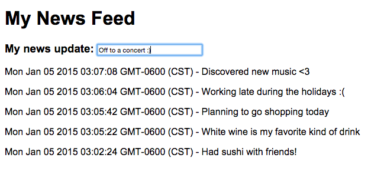

<h1>  News Feed </h1>
<a href="http://ahakone.github.io/comp20-ahakone/newsfeed/"> Link </a>

 Using local storage &amp; jQuery 

<h4> Description </h4>

	Entered message &amp; timestamp is displayed dynamically in the "News" section with the latest update showing first. Messages are stored in local storage so if you leave the page and return to the page, your messages are preserved and  redisplayed. 
	Known bugs: N/A

<h4> Usage </h4>

	Type in a message in the field next to "My news update:"

