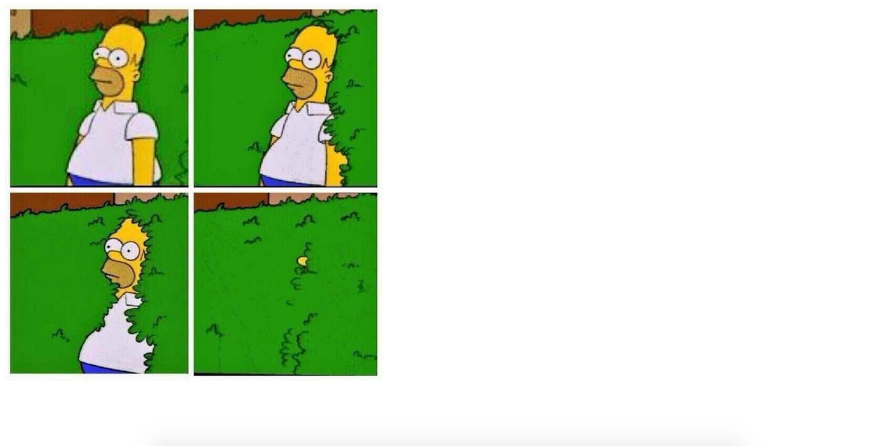
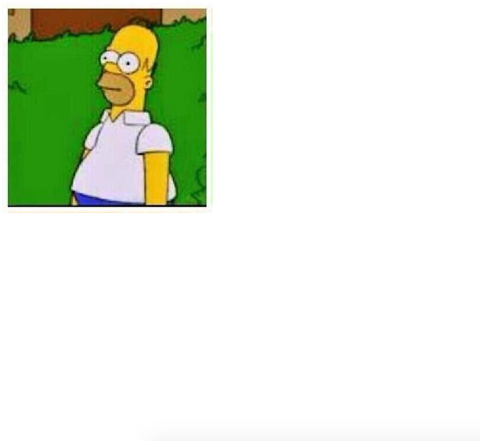
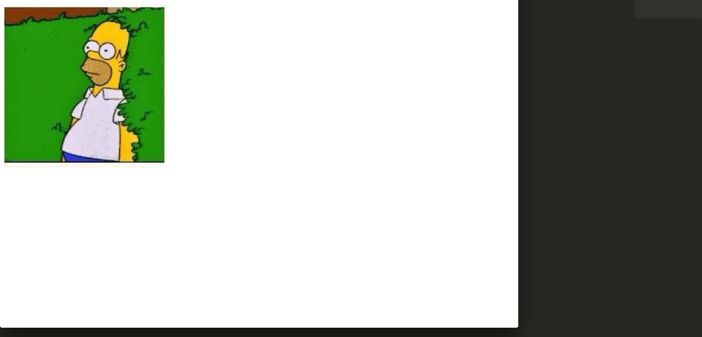
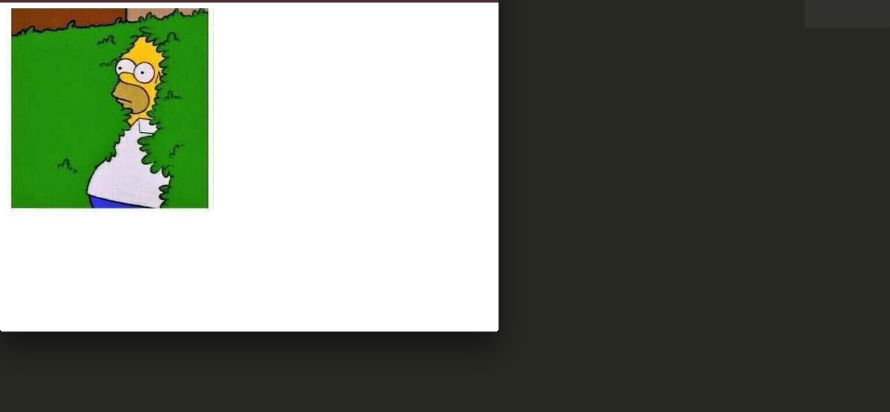
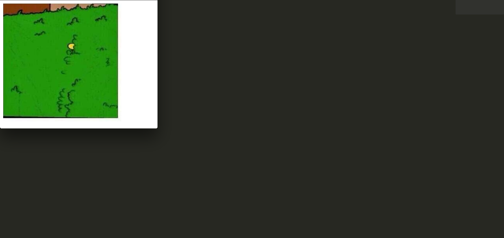

<h1> Homer Simpson Responsive Image</h1>
<a href="https://ahakone.github.io/responsive"> Link </a>

<h4> Description </h4>

	Renders different parts of the Homer Simpson image when the web page is resized.
	<ul> 
		<li> 
			Greater than 1280 pixels 
			 1280 px" style="border:5px solid black">
		</li>
		<li>
			Greater than 1024 pixels but less than or equal to 1280 pixels
			 1024 px and <= 1280px" style="border:5px solid black">
		</li>
		<li>
			Greater than 768 pixels but less than or equal to 1024 pixels
			768 px and <= 1024 px" style="border:5px solid black">
		</li>
		<li>
			Greater than 480 pixels but less than or equal to 768 pixels
			 480 px and <= 768 px" style="border:5px solid black">
		</li>
		<li>
			Less than or equal to 480 pixels
			
		</li>
	</ul>

