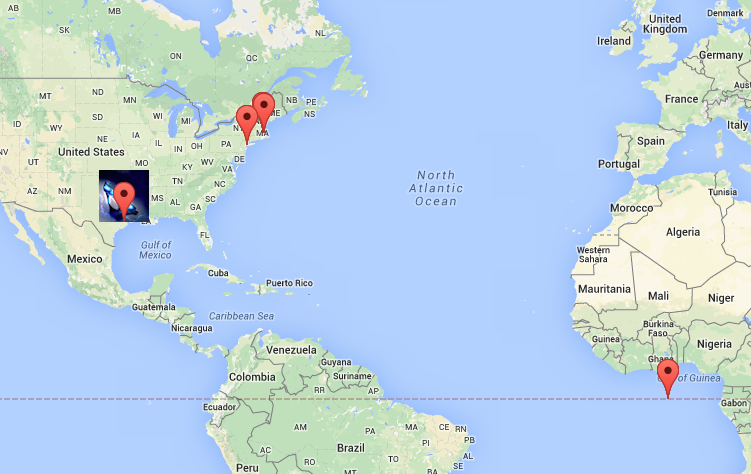
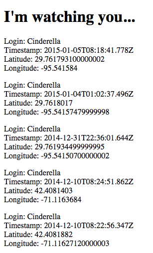

<h1> Where in the World </h1>

 
	Server-side of <a href="https://github.com/ahakone/comp20-ahakone/tree/master/mmap"> Marauder's Map </a>

<h4> Description </h4>

	Web application using Heroku, Node.js with the Express web framework, and MongoDB that stores the user's check-in information (login name, latitude, and longitude). This API is used in the <a href="https://github.com/ahakone/comp20-ahakone/tree/master/mmap"> Marauder's Map </a> project.  
	There are 4 APIs to this application:
	<ol>
		<li>
			POST /sendLocation API  
			  
			Submits the user's check-in information. The mandatory fields for submission to this API are login, lat, and lng. Successful submission of these three pieces of data results in one entry into the MongoDB collection and a return JSON string with the other users' last 100 check-ins. Cross-origin resource sharing is enabled.  
		</li>
		<li>
			GET /locations.json API  
			Returns a JSON string for a specified login with the check-ins sorted in descending order by timestamp. The mandatory parameter is a login name. Cross-origin resource sharing is enabled.  
		</li>
		<li>
			/ - Home, the root, the index in HTML  
			  
			Accessing this on a web browser displays a list of all the check-ins (login name, timestamps, latitude, longitude) for all logins sorted in descending order by timestamp.  
		</li>
		<li>
			GET /redline.json API  
			Returns a live copy of the JSON string from <a href="http://developer.mbta.com/lib/rthr/red.json"> MBTA redline locations </a>. Cross-origin resource sharing is enabled. See the <a href="https://github.com/ahakone/comp20-ahakone/tree/master/redline"> Redline </a> project for an example of how to use this API.
		</li>
	</ol>
	* The security risks of this API is summarized <a href="http://ahakone.github.io/security/"> here </a>.

 
<h4> Collab </h4>

 Discussed with: Duyen Nguyen 

